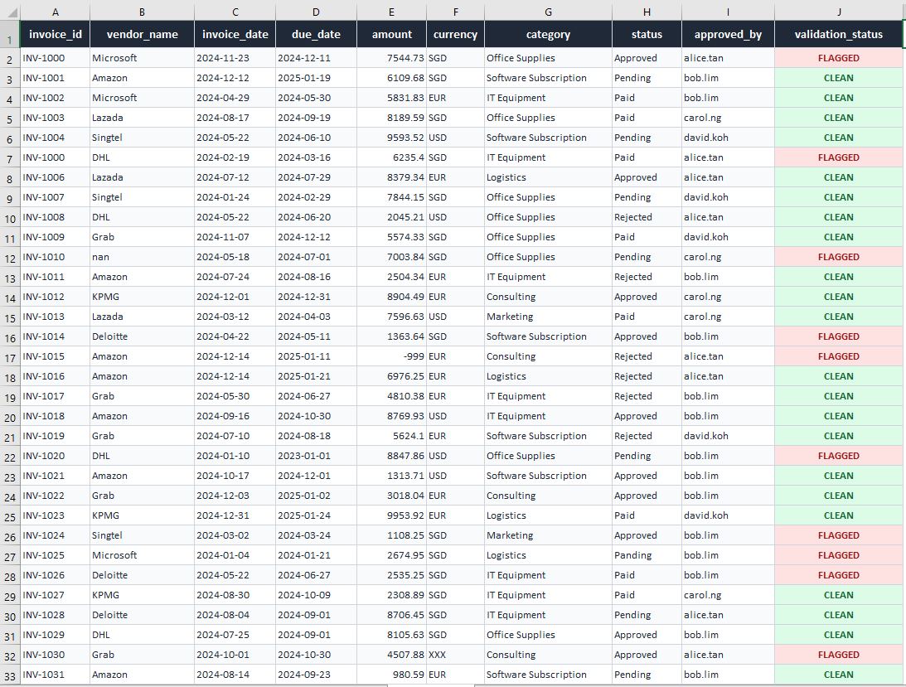

# Multi-Agent Data Validation System

An AI-powered data validation pipeline that combines rule-based checks 
with Claude AI anomaly detection to automatically audit corporate 
invoice data and generate professional validation reports.

## Overview

Traditional data validation catches obvious errors like missing fields 
or wrong formats. This system goes further — it uses a multi-agent 
architecture where a dedicated AI agent reasons about semantic anomalies 
that rules alone cannot detect, such as vendor impersonation, unusual 
spending patterns, and category mismatches.



## System Architecture

Input (CSV / Excel)
│
▼
┌─────────────────────┐
│  Agent 1: Ingestion │  Loads file, profiles data, detects
│  & Profiling        │  nulls, duplicates, column types
└─────────┬───────────┘
│
▼
┌─────────────────────┐
│  Agent 2: Rule-     │  Validates against 7 business rules:
│  Based Validation   │  duplicates, nulls, negative amounts,
│                     │  date logic, status, currency, approvers
└─────────┬───────────┘
│
▼
┌─────────────────────┐
│  Agent 3: AI        │  Sends data to Claude API for semantic
│  Anomaly Detection  │  anomaly detection — catches what rules
│  (Claude API)       │  cannot: fraud patterns, outliers,
│                     │  vendor impersonation, mismatches
└─────────┬───────────┘
│
▼
┌─────────────────────┐
│  Agent 4: Report    │  Compiles all findings into a
│  Generation         │  professional Excel report with
│                     │  4 sheets and colour-coded results
└─────────────────────┘
│
▼
Output: validation_report.xlsx

## What It Detects

### Rule-Based (Agent 2)
- Duplicate invoice IDs
- Missing vendor names
- Negative or zero amounts
- Due date before invoice date
- Invalid status values (typos)
- Invalid currency codes
- Unknown approvers

### AI-Detected (Agent 3)
- Vendor name impersonation (e.g. "Amazom" vs "Amazon")
- Amounts statistically abnormal for a vendor or category
- Category and vendor mismatches (e.g. logistics company billed as Office Supplies)
- Invoices approved by unrecognised users
- Extreme outliers that suggest fraud risk

## Output Report

The generated Excel report contains 4 sheets:

| Sheet | Contents |
|---|---|
| Executive Summary | KPI cards, data profile, run metadata |
| Rule Violations | All rule breaches with severity (CRITICAL / WARNING) |
| AI Anomalies | Claude's findings with anomaly type and severity |
| Cleaned Data | Full dataset with FLAGGED / CLEAN status per row |

## Tech Stack

| Tool | Purpose |
|---|---|
| Python 3.11+ | Core language |
| Anthropic Claude API | AI anomaly detection (claude-sonnet-4-5) |
| Pandas | Data loading and processing |
| Pydantic | Typed data models between agents |
| OpenPyXL | Excel report generation |

## Project Structure
multi-agent-validator/
│
├── agents/
│   ├── ingestion_agent.py      # Agent 1: load and profile data
│   ├── validation_agent.py     # Agent 2: rule-based checks
│   ├── anomaly_agent.py        # Agent 3: Claude AI detection
│   └── report_agent.py         # Agent 4: Excel report generation
│
├── core/
│   ├── orchestrator.py         # Controls agent sequence and flow
│   └── models.py               # Shared Pydantic data models
│
├── sample_data/
│   └── invoices_sample.csv     # Realistic sample data with injected errors
│
├── output/                     # Generated reports saved here
├── main.py                     # Entry point
├── requirements.txt
└── README.md

## Setup

```bash
# Clone the repository
git clone https://github.com/eyyuen/multi-agent-validator.git
cd multi-agent-validator

# Install dependencies
pip install -r requirements.txt

# Set your Anthropic API key
export ANTHROPIC_API_KEY=your_api_key_here

# Run the pipeline
python main.py
```

## Sample Results

Running against the included sample dataset (50 invoice records):

- **8 rule violations** detected by Agent 2
  - 5 critical (duplicate ID, missing vendor, negative amount, invalid date, )
  - 3 warnings (invalid status, invalid currency, unknown approver)
- **15 AI anomalies** detected by Agent 3
  - Including vendor impersonation ("Amazom"), $250,000 outlier invoice,
    and $45,000 Office Supplies categorisation

## Key Design Decisions

**Why multi-agent instead of one script?**
Each agent has a single responsibility. This makes the system easier to 
test, extend, and maintain. New validation rules can be added to Agent 2 
without touching the AI logic in Agent 3.

**Why combine rules and AI?**
Rules are fast, deterministic, and auditable. AI catches semantic patterns 
rules cannot express. Together they provide layered coverage — neither 
approach alone is sufficient for real-world data quality.

**Why Pydantic models?**
Typed data contracts between agents prevent silent failures. If an agent 
returns unexpected data, the system fails loudly rather than producing 
a wrong report silently.

## Limitations and Future Improvements

- Currently supports CSV and Excel input only
- AI anomaly detection may produce false positives on small datasets 
  where vendor averages are skewed by the injected dirty data
- Future: add database connector (PostgreSQL, BigQuery)
- Future: add Slack/email alerting when critical violations are found
- Future: add a web UI for non-technical users to upload files

## Author

Yuen Wei Ling — [GitHub](https://github.com/eyyuen) | 
[LinkedIn](https://linkedin.com/in/your-profile)
